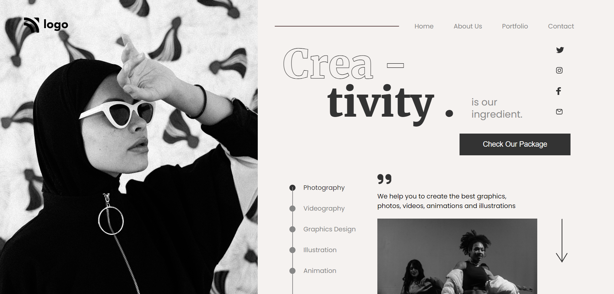

# Project 14

## Project 14 [Live link]()

- Skills Gained in this project 
    - Learned a lot about **relative & absolute** position.
    - Learned **text-stroke-width** to create outline text effect.
    - Also Learned to create stepper using list item & div (By using relative & absolute).
    

## Time Taken to Complete this project
    - 8 Hours taken to Complete it.

### ScreenShot
